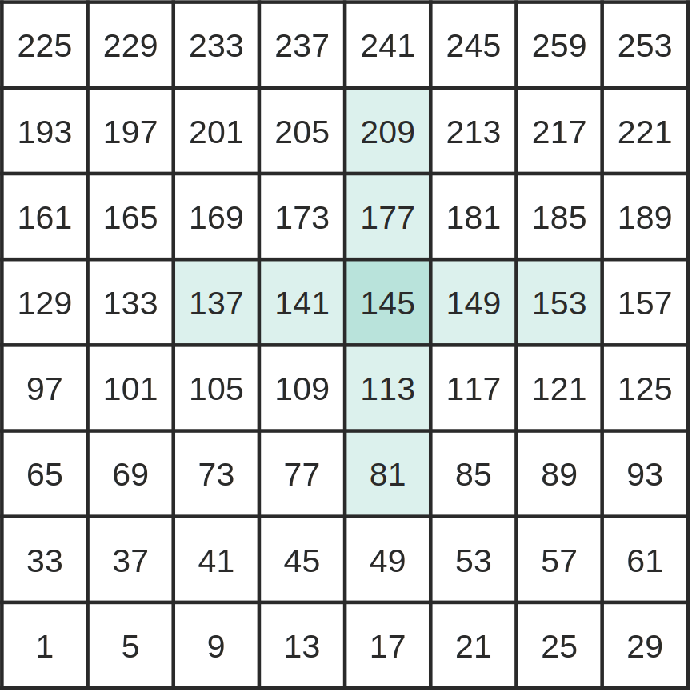

.. -----------------------------------------------------------------------------
    (c) Crown copyright Met Office. All rights reserved.
    The file LICENCE, distributed with this code, contains details of the terms
    under which the code may be used.
   -----------------------------------------------------------------------------

.. _simple_diffusion_tutorial:

The Data Model (Simple Diffusion)
=================================
This tutorial is designed to provide an introduction to the LFRic data model and
how to write kernels to perform calculations on the data held within a field.

The kernel performs the diffusion calculation on a tracer field, and we will be
modifying it to extend its capability to include diffusion in both horizontal
directions of mesh cells.

.. Note::
    This tutorial assumes you have already set up your environment with the
    required dependencies as described in the :ref:`software dependencies`
    section of this documentation.

Cloning the Repository
----------------------
The source code for the simple diffusion application is available in the LFRic
repository. To clone the repository, you can use the following command:

.. code-block:: bash

    git clone https://github.com/metoffice/lfric_core.git

Alternatively, if you have a GitHub account, you can fork the repository and
clone your forked version. This is the method you would follow if you intend
to make changes to the code and submit a pull request.

For more details on the working practices for contributing to the LFRic
Core/Apps codebase, please refer to the :doc:`Simulation Systems<simsys:index>`
documentation.

The Application Layout
----------------------

.. code-block:: rst
    :name: sd_dir_struct
    :emphasize-lines: 2, 5, 6, 9, 10, 12
    :caption: Directory structure of the simple diffusion application

    simple_diffusion
    ├── bin
    ├── build
    ├── documentation
    ├── example
    ├── Makefile
    ├── metadata
    ├── optimisation
    ├── rose-meta
    ├── source
    ├── unit-test
    └── working

The :ref:`above <sd_dir_struct>` listing shows the directory structure of the
simple diffusion application directory. Highlighted are the directories that
are important for this tutorial. The :code:`bin` and :code:`working` directories
are generated during the build process and are not present in the repository.
The :code:`rose-meta` directory contains metadata that is used both by the Rose
application configuration system and by the LFRic configuration system.
The :code:`Makefile` is used to build the application. Finally, the
:code:`source` directory contains the source code for the application and the
:code:`example` directory contains a canned test that can be run from the
command line to demonstrate and test the application.

.. dropdown:: Have a go
    :color: info
    :icon: info

    To build the :code:`simple-diffusion` application first navigate to the
    application directory:

    .. code-block:: bash

        cd applications/simple_diffusion

    Then run the build command:

    .. code-block:: bash

        make build

    Once the application has been built you should see a new :code:`bin`
    directory containing the executable. You can then run the application with
    the canned test in the example directory with the following commands:

    .. code-block:: bash

        cd example
        ../bin/simple_diffusion configuration.nml

    On successful completion of the application you should see a log message
    stating

    .. code-block::

        20260608150939.585+0100:INFO : simple_diffusion application completed.

    You may wish to visualise the output of the application. The output files
    are in an unstructured UGRID NetCDF format, the output file is called
    :code:`diffusion_diag.nc`. This can be visualised using
    `GeoVista <https://github.com/bjlittle/geovista>`_.

The Model Structure
-------------------
LFRic applications are developed around the
:ref:`PSyKAl design<psykal and datamodel>` which governs the separation of
concerns between the scientific code and the technical code. This design can
be best described by the :ref:`PSyKAl<psykal>` diagram. The layout of the source
code in the :code:`source` directory reflects this design, with the scientific
code being contained in the :code:`algorithm` and :code:`kernel` directories.
The Parallel System (PSy) Layer code is generated at build time by the
:doc:`PSyclone<psyclone:index>` domain specific compiler, details on this aspect
of LFRic will not be covered in detail in this tutorial.

.. code-block:: rst
    :name: source_dir_struct
    :caption: Source files.

    source
    ├── algorithm
    │   ├── simple_diffusion_alg_mod.x90
    │   └── simple_diffusion_constants_mod.x90
    ├── driver
    │   ├── init_simple_diffusion_mod.F90
    │   ├── simple_diffusion_driver_mod.f90
    │   └── simple_diffusion_mod.f90
    ├── kernel
    │   └── tracer_tutorial_diff_kernel_mod.F90
    └── simple_diffusion.f90

The :ref:`source <source_dir_struct>` listing shows the source files for the
simple diffusion application. The :code:`driver` directory contains the driver
code for the application, which is responsible for setting up the simulation and
calling the algorithm code. The :code:`algorithm` directory contains the
scientific algorithms that perform calculations on whole fields by either
calling :ref:`PSyclone builtins<psyclone:psykal-built-ins>` or by calling
kernels. All algorithms that require PSyclone must have the file extension
:code:`.x90` to indicate that they are PSyclone compatible. The :code:`kernel`
directory contains the kernels that can be called from the algorithm code to
perform calculations on a single mesh cell.

In the algorithms calls to builtins and kernels are made through calls using
the PSyclone :code:`invoke` keyword. This is used as if it were a subroutine
call, but the code that is executed when the application is run is generated at
build time by PSyclone. For example, the following code snippet is taken from
the :code:`simple_diffusion_alg_mod.x90` file and shows the use of a PSyclone
builtin that performs and increment update of a field by adding the second field
to the first and returning it (i.e. :code:`field1 = field1 + field2`).

.. literalinclude:: /../../applications/simple_diffusion/source/algorithm/simple_diffusion_alg_mod.x90
    :language: fortran
    :lines: 89
    :linenos:
    :lineno-start: 89

A list of available builtins can be found in the
:ref:`LFRic builtins<psyclone:lfric-built-ins>` section of the PSyclone
documentation.

Kernels are called using the same :code:`invoke` keyword, but instead of
calling a builtin, the name of the kernel is used. For example, the following
code snippet is taken from the :code:`simple_diffusion_alg_mod.x90` file and
shows the use of the :code:`tracer_tutorial_diff_kernel` kernel.

.. literalinclude:: /../../applications/simple_diffusion/source/algorithm/simple_diffusion_alg_mod.x90
    :language: fortran
    :lines: 75-82
    :linenos:
    :lineno-start: 75
    :emphasize-lines: 4-8

As you can see, multiple kernels and builtins can be called in the same invoke
statement, and the order of execution is determined by the order in which they
are listed in the invoke statement. Invoke statements can (but aren't required
to) have names which are used to define the subroutine names in the
generated PSy layer code. This can be useful for debugging and optimisation
purposes.

When calling a kernel via an invoke statement, the arguments that are passed to
the kernel are defined by the kernel metadata.

.. literalinclude:: /../../applications/simple_diffusion/source/kernel/tracer_tutorial_diff_kernel_mod.F90
    :name: tracer_kernel_metadata
    :caption: Kernel metadata for the tracer diffusion kernel
    :language: fortran
    :lines: 33-44
    :linenos:
    :lineno-start: 33

Kernel metadata is used to define both the arguments that need to be passed
to the kernel type from the invoke statement and to tell PSyclone how to
generate the PSylayer code which calls the kernel :code:`_code` subroutine.

For example, the :ref:`kernel metadata<tracer_kernel_metadata>` snippet above
defines four fields. The first field is the tracer field that we want to
diffuse. The field is defined with four arguments in the metadata,
:code:`GH_FIELD` indicates that the argument is a field, :code:`GH_REAL`
defines the kind of the field data, :code:`GH_WRITE` indicates that the kernel
will write to this field, and :code:`Wtheta` tells us that the field is defined
on the Wtheta function space. Detailed information on the different argument
types and their properties can be found in the PSyclone
:ref:`LFRic API Metadata<psyclone:lfric-api-kernel-metadata>` documentation.

PSyclone uses the kernel metadata to generate the PSy layer code that calls the
kernel. The generated call will match the subroutine signature of the kernel
:code:`_code` subroutine. For example, the following code snippet is taken from
the :code:`tracer_tutorial_diff_kernel_mod.F90` file and shows the subroutine
signature. The first argument is always the number of layers in the Mesh of the
first field in the kernel metadata. The next arguments are the field data
arrays in the order defined in the kernel metadata. Also notice how the second
field has two additional arguments that appear directly following the field data
array. These are the stencil size and the stencil array for the second field.
This stencil information is defined in the metadata as :code:`STENCIL(CROSS)`.

    Example of what a depth two stencil for a cell-centred field with 4
    layers on an 8x8 mesh might look like. The image shows the bottom layer
    of the field. As DoFs are held in columns, accessing the DoF in the cell
    above is a simple matter of adding 1 to the DoF value, as such only
    the bottom layer of DoFs are held in DoF-maps.

   Example of what the stencil DoFmap for the cell with DoF number 145
   would look like. The order of the stencil DoFmap starts in the centre
   and goes out along each branch in the order of West, South, East,
   North.

.. literalinclude:: /../../applications/simple_diffusion/source/kernel/tracer_tutorial_diff_kernel_mod.F90
    :name: tracer_kernel_code
    :caption: Subroutine call signature for the tracer diffusion kernel
    :language: fortran
    :lines: 69-77
    :linenos:
    :lineno-start: 69

The kernel code itself performs a diffusion calculation on the tracer field
using the Heat equation with a diffusion coefficient D.

.. math::
    \frac{\partial\phi\left(r,t\right)}{\partial t}
    =D\nabla^2\phi\left(r,t\right)
    =D\left(\frac{\partial^2\phi}{\partial x}+\frac{\partial^2\phi}{\partial y}\right)

To solve this in LFRic we use a central difference scheme in space and explicit
forward time stepping.

.. math::
    \delta\phi_x=\frac{D\left(\phi_{x+1}-2\phi_x+\phi_{x-1}\right)}{\operatorname{h}^2}

To do this in the kernel we use the stencil information for the second field to
access the values of the field in the neighbouring cells and calculate the
diffusion update for the tracer field. This increment value is then added to the
tracer field using a PSyclone builtin in the algorithm code.

.. dropdown:: Have a go
    :color: info
    :icon: info

    Currently the kernel only performs the diffusion calculation in the x
    direction. Here you will extend the kernel to perform the diffusion
    calculation in the y direction as well (the x and y directions are in
    reference to a single cell, the x direction of a cell on one panel of a
    cubed sphere may not be the same as that of a cell on another panel).
    This will require us to modify the kernel to access the values of the field
    in the y direction and to calculate the additional
    :math:`\frac{\partial^2\phi}{\partial y}` term in the diffusion calculation.

    The main points to consider when adding the additional diffusion term are:

    #. The location of the values in the field array for the cell at the base of
       the column the kernel is operating on are defined by the DoF values in
       the DoFmap for the field (e.g. map_w2 for the field :code:`dx_at_w2`).
    #. The location of the values in the field array for the neighbouring cells
       are defined by the stencil DoFmap for the field (e.g.
       :code:`map_wt_stencil` for the field :code:`theta_n`).

    The sections of the kernel code that need to be modified are those that
    calculate the horizontal grid spacing:

    .. literalinclude:: /../../applications/simple_diffusion/source/kernel/tracer_tutorial_diff_kernel_mod.F90
        :name: tracer_kernel_grid_spacing
        :language: fortran
        :lines: 131-133
        :linenos:
        :lineno-start: 131

    and those that calculate the diffusion increment:

    .. literalinclude:: /../../applications/simple_diffusion/source/kernel/tracer_tutorial_diff_kernel_mod.F90
        :name: tracer_kernel_diff_increment
        :language: fortran
        :lines: 140-144
        :linenos:
        :lineno-start: 140

